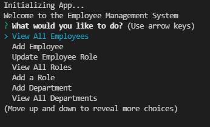
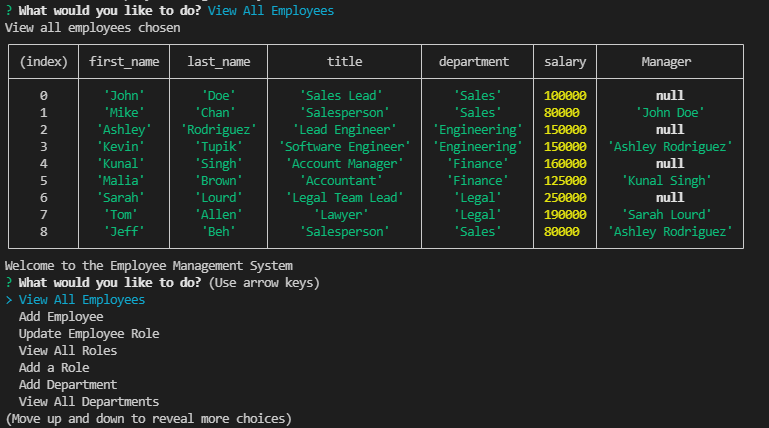

# Employee_Management_System
=============================

## Description
An application used to add, view, and update employees in a given database using mySQL with sequelize and Node.js with inquirer.

## Table of Contents
* [Installation](#installation)
* [Usage](#usage)
* [License](#license)
* [Links](#links)
* [Questions](#questions)

## Installation
To install necessary dependencies, run the following command:
        
        npm i

## Usage
This application must be run in Node
The user is able to select options displayed in the Terminal using arrow buttons and the 'Enter' Key
  
After completion of an option, the user is able to choose again from the following options until they decide to exit the application by choosing 'Quit'

## License
  
This project is licensed under the MIT license.

## Links 
Repo: https://github.com/Jeffiftyone/Fitness_Tracker7  
Video Demo: https://watch.screencastify.com/v/vb8DCN0JuYGsYC2Kqd4t

## Questions
If you have any queations regarding the repo, open an issue or contact me directly at [jeffrey.beh@hotmail.com](mailto:jeffrey.beh@hotmail.com).
You can find more of my work at [jeffiftyone](https://github.com/jeffiftyone)
